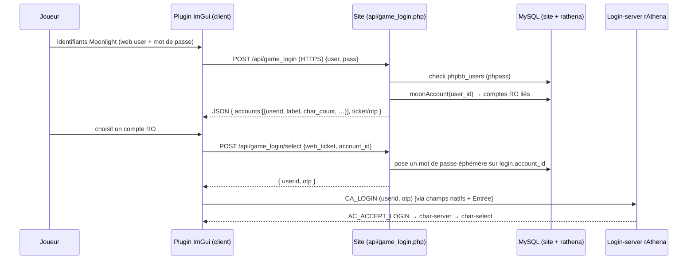

# Conception — Authentification ImGui moderne + login « compte Moonlight »

Proposition de remplacement de l'écran de login natif par une **UI ImGui
moderne**, avec pour objectif central : **se connecter avec son compte Moonlight
(web/forum) et choisir quel compte Ragnarok utiliser**, au lieu de saisir
directement les identifiants d'un compte RO.

Prérequis de lecture : [login_flow_re.md](login_flow_re.md) (chaîne native +
modèle de comptes serveur/site).

---

## 1. Le principe (et pourquoi c'est faisable *maintenant*)

Le compte web Moonlight regroupe **déjà** plusieurs comptes RO en base
(`rathena.login.user_id = phpbb_users.user_id`, cf. `moonAccount()`). Il manque
seulement **deux briques** :

1. côté **site** : une API que le client puisse appeler pour valider les
   identifiants web et lister les comptes RO liés ;
2. côté **client** : un **front ImGui** qui collecte les identifiants Moonlight,
   affiche le sélecteur de compte, puis pilote le login RO du compte choisi.

Ce qui rend (2) réalisable sans réécrire le moteur (vérifié, cf. login_flow_re) :

| Levier | Fait établi |
|--------|-------------|
| **Frame ImGui hors-jeu** | `OnRenderLoginUI` est dispatché sur l'écran login/char-select ([plugin.h:45](../src/plugins/plugin.h#L45)). |
| **Capture clavier** | Le hook WndProc alimente ImGui **et avale** le clavier quand `WantCaptureKeyboard` ([ragnarok_client.cc:617](../src/ragnarok/ragnarok_client.cc#L617)) → `InputText` marche, sans conflit avec les champs natifs. |
| **Pilotage du login RO** | Input synthétique éprouvé dans les champs natifs (`AutoLogin`) → `CA_LOGIN` classique, **zéro modif serveur**. |
| **HTTP** | Wrapper libcurl natif (`g_CurlApiTable`) *ou* WinHTTP thread worker (recommandé, autonome). |

---

## 2. Architecture cible



Trois composants :

- **A. Plugin client `MoonlightAuth`** (`src/plugins/moonlight_auth.{h,cc}`) —
  fenêtre ImGui sur l'écran de login (login web + sélecteur de compte), HTTP
  worker, pilotage du login RO choisi.
- **B. Endpoint site `api/game_login.php`** — valide le compte web, liste les
  comptes RO, émet un **mot de passe éphémère (OTP)** pour le compte choisi.
- **C. (Optionnel, phase 2) SSO serveur** — réécriture de
  `logclif_parse_reqauth_sso` (0x0825) pour un vrai jeton web, supprimant la
  rotation de mot de passe.

---

## 3. Le point dur : comment authentifier le compte RO choisi

Le login-server rAthena valide `login.user_pass` (`strcmp` clair / MD5). Le client
doit donc présenter **un secret que le login-server acceptera** pour le compte
choisi. Trois voies :

| Voie | Le client envoie | Modif serveur | Verdict |
|------|------------------|---------------|---------|
| **(1) Renvoyer le mot de passe de jeu** | `userid` + `user_pass` en clair | — | ✗ le site ne stocke qu'un **hash phpBB**, pas de clair récupérable. |
| **(2) OTP éphémère** ⭐ | `userid` + OTP en clair (le site pose `md5(otp)` sur `login.user_pass`) | **aucune** (reste `CA_LOGIN`) | ✔ **Phase 1 recommandée.** Le site fait `UPDATE login SET user_pass=MD5(<otp>)` pour le compte choisi, renvoie l'OTP en clair ; le client `CA_LOGIN(otp)` → le serveur MD5 → match. |
| **(3) Vrai SSO 0x0825** | `userid` + jeton web signé | réécrire `logclif_parse_reqauth_sso` | ✔ **Phase 2** (fin d'état propre, sans rotation). |

### Pourquoi l'OTP (voie 2) est propre ici

Dans le modèle Moonlight, **le joueur ne tape jamais le mot de passe du compte
RO** : le compte RO est *géré* par le compte web. Le mot de passe de jeu n'est
donc pas un secret humain — le roter à chaque connexion est **sans impact
utilisateur** et transforme de fait `login.user_pass` en OTP à usage unique.

- **Confirmé (Stingor)** : le site a été modifié pour hacher en **MD5**, et le
  login-server tourne en `use_MD5_passwords` (il MD5 le mot de passe reçu en clair
  via `CA_LOGIN 0x0064` avant comparaison). Donc l'OTP est trivial : le site pose
  `user_pass = MD5(otp)`, renvoie l'**OTP en clair**, le client le tape → le
  serveur le MD5 → match. `login.user_pass` contient donc du MD5 hex (32 car.),
  compatible avec la longueur du champ.

---

## 4. Phase 1 — MVP (zéro modif C++ serveur)

### 4.1 Endpoint `api/game_login.php` (site)

Réutilise l'infra existante (`moonAccount()`, accès cross-DB, `phpbb_hash`).

**Requête A — login** `POST /api/game_login.php` (multipart ou form-url-encoded,
HTTPS obligatoire) :
```
action=auth  username=<web>  password=<web>
```
**Réponse A** (JSON) :
```json
{
  "ok": true,
  "web_ticket": "<opaque, TTL 120s, en session serveur>",
  "accounts": [
    { "account_id": 2000001, "userid": "moon_main", "label": "moon_main",
      "char_count": 3, "last_login": "2026-07-20", "banned": false },
    { "account_id": 2000042, "userid": "moon_alt",  "label": "moon_alt",
      "char_count": 1, "last_login": "2026-06-02", "banned": false }
  ]
}
```
Logique : `sql_fetch phpbb_users WHERE username=?` → `phpbb_check_hash(pass,
user_password)` → si OK, `moonAccount(user_id)` → map en `accounts[]`. Émettre un
`web_ticket` court (table `game_login_ticket(ticket, user_id, expires)` ou session).

**Requête B — sélection** `POST /api/game_login.php` :
```
action=select  web_ticket=<…>  account_id=<choisi>
```
Serveur : vérifie le ticket, vérifie que `account_id ∈ moonAccount(user_id)`
(anti-IDOR), génère un OTP aléatoire (≥16 o), `UPDATE rathena.login SET
user_pass=MD5('<otp>') WHERE account_id=? AND user_id=?` (login-server en
`use_MD5_passwords`), invalide le ticket.
**Réponse B** :
```json
{ "ok": true, "userid": "moon_alt", "otp": "a1b2c3d4e5f6g7h8" }
```

Garde-fous site : HTTPS, rate-limit par IP/compte, journaliser, refuser comptes
bannis/`state!=0`, longueur OTP compatible `login.user_pass` (≤32).

### 4.2 Plugin client `MoonlightAuth`

Modèle : sous-classe `Plugin`, dessine dans `OnRenderLoginUI`. Machine à états :

```
kWebLogin   → formulaire ImGui (user/pass Moonlight, [x] mémoriser)
kAuthing    → HTTP worker POST action=auth (spinner)
kPickAccount→ liste ImGui des comptes (nom, nb persos, dernière connexion, ban)
kSelecting  → HTTP worker POST action=select (spinner)
kDriveLogin → réutilise la mécanique AutoLogin : tape userid+otp dans les
              champs natifs, Entrée → CA_LOGIN ; puis laisse la chaîne native
              (char-server → char-select). Optionnel : auto-confirm char-server.
kError      → message + bouton « réessayer »
```

Points d'implémentation (repris des patterns validés) :

- **HTTP hors thread principal** : WinHTTP sur un `std::thread`, résultat publié
  via `std::atomic`/mutex, l'UI **poll** (jamais de call bloquant dans le frame —
  cf. `feedback_no_blocking_dialog_main_thread`).
- **Rendu** : `ImGui::Begin` centré ; garde `DisplaySize>0` (minimize) ;
  masquer/estomper la parade Poring pendant le formulaire (coordination avec
  `LoginParade`). Champ mot de passe = `ImGuiInputTextFlags_Password`.
- **Pilotage login** : réutiliser `AutoLogin::TypeString/PressKey`
  ([auto_login.cc:279](../src/plugins/auto_login.cc#L279)) — ou factoriser ces
  deux helpers dans un util partagé. `userid`+`Tab`+`otp`+`Entrée`.
  ⚠ La **case « Save ID »** native change le focus initial : forcer un état connu
  (décochée) ou gérer l'ordre comme `AutoLogin` (`save_id_`).
- **Persistance** : « mémoriser » stocke *l'identifiant web* (jamais le mot de
  passe de jeu, ni l'OTP) dans `bourgeon_settings.yaml`. L'OTP est volatil.
- **Cacher/neutraliser l'UI native** : par défaut, **superposer** (le formulaire
  ImGui capte le clavier, l'UI native reste dessous mais inutilisée). Option
  avancée : masquer `UILoginWnd` via son flag natif de visibilité (`+0x28`,
  **jamais** par déplacement hors-écran — cf. `feedback_no_offscreen_hide`).

### 4.3 Ce que Phase 1 NE touche pas

- Login-server C++ : **inchangé** (reste `CA_LOGIN`).
- Paquets custom / opcodes : **aucun**.
- Intégrité : **aucun bump de hash en dev** (cf. `feedback_no_integrity_edits`).

---

## 5. Phase 2 — SSO propre (0x0825), sans rotation de mot de passe

Fin d'état idéale : plus d'écriture de `user_pass`, un **jeton web signé** à usage
unique résolu en `account_id` côté login-server.

1. **Site** : `action=select` renvoie un **jeton** signé (HMAC serveur) encodant
   `{account_id, exp}` au lieu d'un OTP ; persiste éventuellement un nonce
   à usage unique (table `sso_nonce`).
2. **Login-server** : réécrire `logclif_parse_reqauth_sso`
   (`src/login/loginclif.cpp:328-360`) — au lieu de « token = password » :
   vérifier la signature/nonce du jeton, en extraire `account_id`, charger le
   compte par `account_id` et **court-circuiter `login_check_password`**. Le
   paquet `CA_SSO_LOGIN_REQ` (0x0825, `token[]` variable) **ne change pas**.
3. **Client** : envoyer 0x0825 avec `username=userid, token=<jeton>`. Deux voies :
   - **Directe** : construire le paquet et `Bourgeon::SendPacket` — nécessite de
     finir la RE de la région login-connect `0x00d24xxx` (état `this+0x04`,
     ouverture socket) pour envoyer au bon moment. RE ciblée à faire.
   - **Via `-t:`** : le transport token natif est déjà câblé (`g_HasLoginToken`
     `0x015ffa8c`, lu `0x00d24a6a`) — mais implique un (re)lancement avec
     `-t:<token>` ⚠ (cf. `feedback_dont_relaunch_game` : à éviter ; la voie
     directe est préférable).

Avantages Phase 2 : pas de mutation de `user_pass`, jeton à courte vie signé,
révocable ; s'aligne sur le mécanisme SSO officiel du client.

---

## 6. Comparatif & recommandation

| Critère | Phase 1 (OTP) | Phase 2 (SSO 0x0825) |
|---------|---------------|----------------------|
| Modif login-server C++ | Aucune | `logclif_parse_reqauth_sso` réécrit |
| RE client supplémentaire | Aucune (réutilise AutoLogin) | Finir région `0x00d24xxx` (envoi direct) |
| Site | 1 endpoint | 1 endpoint (jeton signé) |
| Mutation `user_pass` | Oui (OTP à chaque login) | Non |
| Robustesse | Bonne | Meilleure (jeton signé/révocable) |
| Délai de livraison | Court | Moyen |

**Recommandation : livrer Phase 1** (front ImGui + endpoint OTP), qui atteint
l'objectif « login Moonlight + choix du compte » **sans toucher au serveur de
jeu**, puis **migrer vers Phase 2** quand on veut supprimer la rotation de mot de
passe et un vrai SSO.

---

## 7. Points ouverts à trancher (avant implémentation)

1. **Format du mot de passe côté login-server** : ✅ **résolu** — MD5
   (`use_MD5_passwords`, site modifié pour hacher en MD5). L'OTP se pose en
   `MD5(otp)` et se transmet en clair. Rien à trancher ici.
2. **Où stocker le `web_ticket`/OTP** : session PHP vs table dédiée + TTL/GC.
3. **UI native** : superposition simple (recommandé) vs masquage du `UILoginWnd`.
4. **Coordination `LoginParade`** : estomper/désactiver la parade quand le
   formulaire d'auth est ouvert.
5. **Multi-connexion / service select** : si `clientinfo.xml` a plusieurs
   `<connection>`, l'endpoint doit-il aussi piloter le choix du monde, ou reste-t-il
   au niveau compte ? (Par défaut : un seul monde → on ignore.)
6. **Sécurité endpoint** : HTTPS strict, rate-limit, anti-IDOR (`account_id ∈
   moonAccount(user_id)`), refus comptes bannis, logs.

---

## 8. État d'implémentation (Phase 1 — FAIT, à builder/déployer)

Le MVP Phase 1 est **codé** (build + déploiement laissés à l'utilisateur, cf.
`feedback_dont_relaunch_game` / `feedback_no_integrity_edits`) :

- **Client** — `src/plugins/moonlight_auth.{h,cc}` : formulaire ImGui, worker
  WinHTTP non bloquant, sélecteur de compte, délégation à
  `AutoLogin::DriveWithCredentials(userid, otp, save_id)` (nouvelle méthode
  publique). Enregistré dans `Bourgeon::LoadPlugins()` (reçoit le `AutoLogin*`) et
  ajouté à `src/CMakeLists.txt` (`winhttp` + `nlohmann/json` déjà liés/inclus).
- **Site** — `moonlightsite/api/game_login.php` : actions `auth` (valide
  `phpbb_users` via `phpbb_check_hash`, liste les comptes RO liés) et `select`
  (pose `user_pass = MD5(otp)`, renvoie l'OTP). Ticket = **jeton HMAC sans état**
  (aucune table ni session — le client WinHTTP ne porte pas de cookies).

### Baseline — activé d'origine, aucune config utilisateur
Cette méthode **remplace le login par défaut** : le plugin est **activé
d'origine** avec l'URL du serveur **intégrée au build** (`kDefaultBaseUrl` dans
`moonlight_auth.cc`). Un joueur n'a **rien à éditer**. La section yaml
`moonlight_auth:` est **optionnelle** et ne sert qu'à *surcharger* (dev/local, ou
`enabled: false` pour retomber sur le login natif) :
```yaml
moonlight_auth:            # OPTIONNEL — surcharge seulement
  base_url: "http://127.0.0.1"   # ex. pointer un site local en dev
  enabled: false                 # ex. désactiver ponctuellement
  save_id: false
  remember: true
```

### À faire
1. **Client** : régler `kDefaultBaseUrl` sur le vrai domaine du site.
2. **Site** : `GAME_LOGIN_SECRET` défini ; servir en **HTTPS**.
3. ⚠ **Filet de sécurité (UX, recommandé baseline)** : comme le formulaire ImGui
   supersède le login natif, une panne du site/endpoint **verrouillerait tous les
   joueurs**. Prévoir un bouton « Login classique » qui masque le formulaire pour
   la session (repli sur les champs natifs).
4. **Builder** (réécrit le hash d'intégrité + déploie → à ta main) et tester.

### Ensuite
- Migrer vers **Phase 2 (SSO 0x0825)** pour supprimer la rotation de `user_pass`
  (réécriture `logclif_parse_reqauth_sso` + envoi 0x0825 direct côté client).
